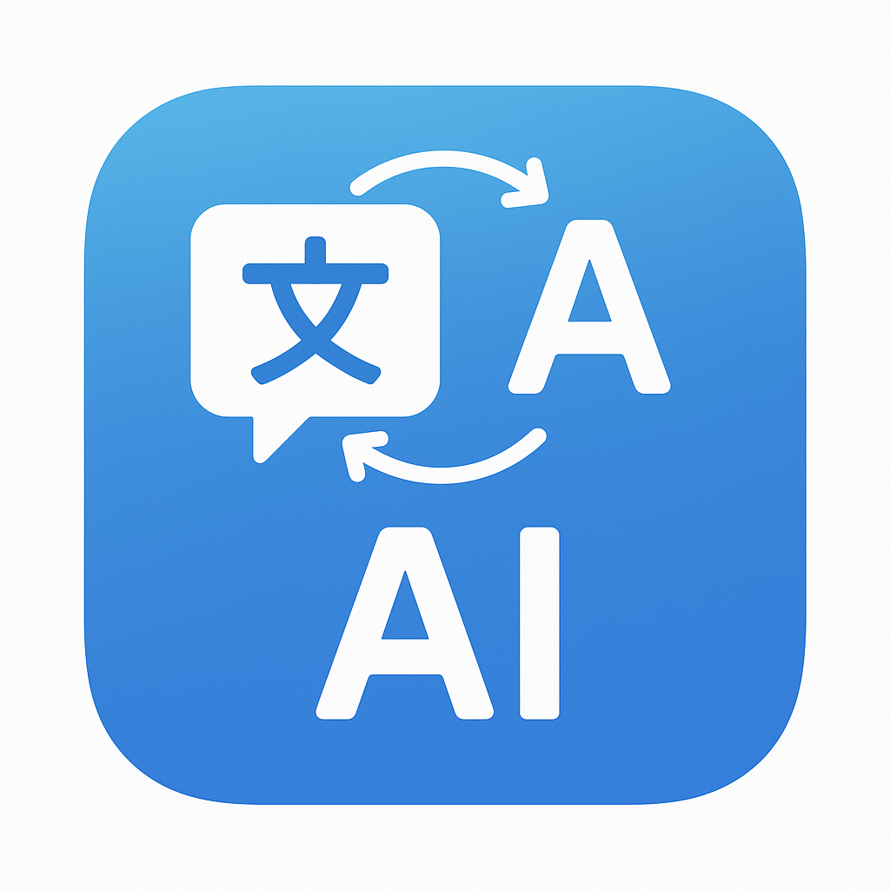

# 中英文同声传译器

<p align="center">
  
</p>


[](https://nodejs.org/)
[](https://nextjs.org/)
[](https://ai.google.dev/)

中文 | [English](README.md)

本软件可根据用户口述的自然语言一键自动化进行汉英同声互译，无需用户任何手动设置。特别适合老年人出国旅游时使用。
无论是洛杉矶的机场、泰国的沙滩，您都无需担心父母是否会遇到语言障碍。这款开源软件开发的初衷就是我的姨夫在美国机场因语言障碍导致出关遇到了麻烦，所以让我教他如何使用AI翻译软件，经过半个小时折腾后我意识到让老年人用好提示词或现有的AI软件的难度不亚于让我重新写一个AI软件。毕竟AI时代我们应当让每一个人都享受AI带来的便利，之后就有了这个开源项目。后续还会开发中日语、中韩语、中越语等多个版本，总之，“哪里不会点哪里”。

## 功能特点

- 🎙️ **语音识别**：通过设备麦克风录制语音
- 🔄 **自动语言检测**：识别语音是英语还是中文
- 🌐 **双向翻译**：在英语和中文之间无缝转换
- 🔊 **文本转语音**：使用浏览器的语音合成功能朗读翻译内容
- 📝 **文本编辑**：直接在应用程序中编辑转录和翻译
- 📱 **响应式设计**：适用于桌面和移动设备
- 🌙 **深色/浅色模式**：可在深色和浅色主题间切换
- 🔒 **客户端处理**：您的录音保留在您的设备上

## 技术栈

- **前端**：Next.js 14、React 18、TypeScript
- **AI**：Google Gemini 2.5 Pro 用于语音识别和翻译
- **音频**：Web Audio API、MediaRecorder API、Speech Synthesis API
- **样式**：具有响应式设计的现代 CSS

## 开始使用

### 前提条件

- Node.js 18.0 或更高版本
- Google Gemini API 密钥（从 [Google AI Studio](https://aistudio.google.com/) 获取）

### 安装

1. 克隆仓库：
   ```bash
   git clone https://github.com/yourusername/gemini-interpreter.git
   cd gemini-interpreter
   ```

2. 安装依赖：
   ```bash
   npm install
   ```

3. 在根目录创建 `.env` 文件并添加您的 Gemini API 密钥：
   ```
   GEMINI_API_KEY=your_api_key_here
   ```

4. 启动开发服务器：
   ```bash
   npm run dev
   ```

5. 在浏览器中打开 [http://localhost:3000](http://localhost:3000)。

### 使用方法

1. 点击并按住麦克风按钮开始录音。
2. 用英语或中文讲话。
3. 松开按钮停止录音并触发翻译。
4. 应用程序将自动检测语言并翻译成另一种语言。
5. 点击扬声器按钮听取翻译。
6. 根据需要编辑转录或翻译内容。

## 工作原理

1. **音频录制**：应用程序使用 MediaRecorder API 捕获音频。
2. **音频可视化**：使用 Web Audio API 在录制过程中生成实时波形。
3. **语音识别**：音频被发送到 Gemini AI 进行转录。
4. **语言检测**：Gemini 识别转录文本是英语还是中文。
5. **翻译**：根据检测到的语言，将文本翻译成另一种语言。
6. **文本转语音**：使用浏览器的语音合成 API 朗读翻译内容。

## 项目结构

```
gemini-interpreter/
├── app/
│   ├── components/
│   │   ├── VoiceNotesApp.tsx    # 主应用程序组件
│   │   ├── SettingsModal.tsx    # API 密钥设置模态框
│   │   └── ServiceWorkerRegister.tsx
│   ├── utils/
│   │   ├── audioService.ts      # 音频录制和播放
│   │   ├── geminiService.ts     # Gemini API 集成
│   │   └── helpers.ts           # 实用函数
│   ├── layout.tsx               # Next.js 布局
│   ├── page.tsx                 # 主页面
│   └── globals.css              # 全局样式
├── public/
├── next.config.js
├── package.json
└── README.md
```

## 局限性

- 需要麦克风访问权限和浏览器对 MediaRecorder API 的支持
- 翻译质量取决于 Gemini AI 模型的能力
- 目前只支持英语和中文语言对
- 需要互联网连接以调用 Gemini API

## 未来改进

- 添加更多语言支持
- 实现流式翻译以进行实时口译
- 添加语音到语音的直接翻译
- 改进音频可视化，提供更详细的波形
- 将翻译历史保存到本地存储或数据库
- 添加翻译导出选项

## 许可证

本项目采用 MIT 许可证 - 详情请参阅 LICENSE 文件。

## 致谢

- 感谢 Google Gemini AI 提供 AI 模型
- 感谢 Next.js 团队提供出色的框架
- 感谢 Web Audio 和 Speech Synthesis API 实现音频处理

---

由 [Lewis Zhang | 张伟] 用 ❤️ 制作 
